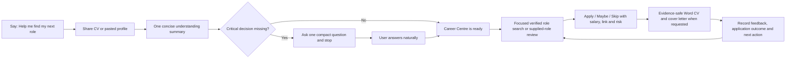

# Career Centre v4 — product review

## Executive verdict

Career Centre v4 is now a credible, provider-neutral career workflow product rather than a large prompt pretending to be one. It has a simple CV-first shell, typed evidence and career state, deterministic Word generation, fail-closed QA, global market defaults, portable learning and a realistic no-publisher-backend distribution model.

The current **ChatGPT functional-beta score is 9.2/10**. The separate **public-release readiness score is 8.9/10**. The installed skill has now passed CV-first setup, stop-turn behaviour, global defaults, advanced preferences, live open/closed-role gates, a returned paired Word pack, natural reference-CV format copying, browser-level Word inspection, portable lifecycle continuity and live scheduled execution. A second scheduled run falsified the assumption that ChatGPT carries printed Passport state across result tasks, so browser schedules are now explicitly snapshot-backed alerts rather than pretend persistent agents. Public readiness remains below 9 because the static legal/support URLs are not live, directory review is incomplete, and personal Plus compatibility is untested.

## Rating movement

The inherited deep review rated the prototype unevenly: skill prototype 8.5, first run 8, documents 8, decision intelligence 7, search 6.5, longitudinal management 5.5, agent capability use 4.5 and public readiness 6. Normalising those dimensions gives an approximate **6.8/10 product-readiness baseline**. The score was not a criticism of the idea; it reflected the gap between strong instructions and enforceable product behaviour.

| Area | Weight | v4 score | Evidence and remaining deduction |
| --- | ---: | ---: | --- |
| First-use simplicity and conversation | 20 | 19.0 | Installed personal-Pro journeys passed: CV-first reading, at most four material questions, hard stop before search, exact seven-line readiness receipt and natural advanced-preference updates. |
| Evidence safety and provenance | 15 | 15.0 | Evidence IDs, source confidence and restrictions are contract-enforced; unsupported claims block packs. |
| Search, exact links and duplicate control | 15 | 12.0 | Live Canada and US tests respected the search budgets, refused closed roles and did not pad. Scheduled runs can suppress the embedded Passport snapshot and within-run aliases, but ChatGPT browser does not provide deterministic cross-run state. |
| Role decision quality | 15 | 14.0 | Live exact-posting tests produced defensible Apply and Skip decisions with salary, employment, fit, shortlist chance, match, risk and CV angle. Probabilities are not yet calibrated from real outcomes. |
| Word application-pack quality | 15 | 15.0 | Installed ChatGPT Work journeys returned a two-page CV and one-page cover letter, then a separate reference-formatted two-page CV base. Independent preview exposed a private-use numbering defect; the validator and builder were fixed, and both later journeys passed with portable U+2022 bullets, minimum-font and density checks. |
| State, feedback and lifecycle continuity | 10 | 8.5 | Portable Passport, corrections, feedback and immutable application events work. Cross-task continuity is portable, not invisible or guaranteed. |
| Runtime integrity, recovery and tests | 7 | 6.5 | Forty-four automated tests, checksums, trigger-contract checks, active-numbering inspection, fail-closed run validation and explicit snapshot/verified-persistence scheduling modes pass. |
| Privacy and distribution readiness | 3 | 2.0 | No Amit-operated data service or model bill; direct ZIP installation works on personal Pro. Public legal/support URLs, directory review and Plus testing are still pending. |
| **Functional beta total** | **100** | **92.0** | **9.2/10 functional beta; public-release readiness remains 8.9/10** |

The earlier product was strongest at positioning and weakest at tracker integrity, Word QA, recovery, longitudinal behaviour and agent capability use. v4 materially closes each of those gaps without requiring a server.

## What the user now experiences

There are no setup cards, project instructions, commands, tracker spreadsheets or folders for the user to manage. The hidden product state remains structured so the model cannot quietly reinterpret an Apply decision, lose a correction or call a missing document successful.

## The ready message

Once the CV and only the critical preferences are understood, the product generates exactly seven active-assumption lines:

1. Target direction and inferred seniority.
2. Starting geography and known work-right boundary.
3. Employer/recruiter-first source mix plus market-relevant boards and salary benchmarks.
4. Currency, compensation floor and employment types.
5. CV page strategy, density and minimum font.
6. Active section order.
7. Word pack and manual-submission boundary.

Experienced candidates default to two pages, with page 1 at least 65% filled and page 2 at least 80% filled. Early-career candidates can default to one strong page. The message does not demand approval; it points to optional advanced preferences.

## Simple defaults and advanced flexibility

| Default path | Optional natural-language change |
| --- | --- |
| Focused search, up to five displayed roles | “Explore more broadly” or “Only use employer sites and these recruiters” |
| Current country plus same-country remote/hybrid | “Add Singapore and UAE, but only where sponsorship is stated” |
| Permanent roles favoured | “Include twelve-month contracts above this rate” |
| Adaptive one/two-page CV | “Always use two pages” or “Keep this to one page” |
| Evidence-led standard section order | “Put projects above experience” or “Remove certifications” |
| Smart professional visual format | “Use this Word CV as the formatting reference” |
| CV plus cover letter | “CV only from now on” or “Ask me each time” |

Format personalisation is intentionally bounded. A reference Word CV can supply page geometry, typeface, hierarchy, colour and spacing when safe. Its body text, personal details, hidden data, comments, tracked changes, headers, footers and author metadata are stripped. Evidence still comes only from the user's own sources.

## Global behaviour

The product has no Australian default. It derives starting geography, currency, work-right boundary, salary interpretation and source language from the candidate and their preferences. Synthetic regression personas now cover:

- a senior candidate in Australia using AUD and a two-page CV;
- a mid-career candidate in Canada using CAD and a fixed-term trade-off;
- an early-career candidate in the United Kingdom using GBP and a one-page CV.

Tests explicitly reject cross-market leakage such as AUD or Australian work-right assumptions appearing in Canadian or UK readiness messages.

## What “memory” honestly means

The learning layer is a portable `Career_Passport.json`, not a hidden publisher database. It records:

- explicit preferences and dated corrections;
- evidence with provenance and wording restrictions;
- role identities, fingerprints and dispositions;
- application-stage events;
- document, search, role and workflow feedback;
- whether a feedback pattern is merely observed or explicitly confirmed.

One rejection or one disliked draft does not silently become a permanent rule. Repeated feedback is proposed as a pattern until the user confirms it. Within a continuing task the Passport is updated quietly; when moving accounts or tasks it can be reused from ChatGPT Library or uploaded as a small portability backup. ChatGPT may also use its own Memory and Library features under the user's settings, but the plugin does not claim deterministic cross-chat memory that it cannot control.

## Engineering and document evidence

Current automated suite: **44/44 passing**.

The test suite covers schema contracts, evidence provenance, exact-link safety, paired-document requirements, reference-format privacy, one/two-page settings, readiness messages, global isolation, Passport corrections, feedback, checksum tampering, missing covers, pending visual review and stray HTML.

Rendered evaluation evidence:

| Persona | Outcome | CV density | Visual result |
| --- | --- | --- | --- |
| Senior transformation | Two-page CV plus one-page cover | Page 1 67.1%; page 2 80.7% | Passed human inspection and run validation |
| Early-career marketing | One-page CV plus one-page cover | CV 56.0%; cover 51.8% | Passed human inspection and run validation |
| Mid-career operations | Fixed-term role assessment, no pack requested | N/A | `SUCCESS_NO_PACK`; duration and annualised compensation explicit |

The signed-in personal ChatGPT Pro web account accepted the v4 ZIP through `Skills → Create → Upload from your computer`. Fresh Work tasks then passed the main conversation journeys: missing work rights caused a three-question stop-turn; the next turn produced the exact seven-line readiness receipt; natural-language advanced CV-field preferences persisted; and a Canadian/CAD fixture showed no Australian leakage.

Live exact-posting tests proved both sides of the gate. Closed Zapier, Scribd and Jane postings were rejected without documents. A newly posted Ashby Workforce Management role produced an Apply decision and a returned Word pack. The first pack looked structurally valid but rendered legacy U+F0B7 bullets as hollow squares in ChatGPT's own preview. The release was stopped, the validator was extended to inspect active numbering definitions, the builder changed to literal U+2022 bullets in the normal font, and a fresh uploaded build passed independent page-by-page preview.

A separate reference-format journey exposed a host-routing defect: the first natural “create a reusable CV base from my CV and this visual reference” request was handled by a generic document workflow and reproduced hollow-box bullets. The Career Centre trigger contract was strengthened to make any personal CV/resume base or reference-format request primary, with generic document tooling allowed only after the career skill loads. After uploading the cache-busted build, a fresh task using ordinary language—without selecting `@career command centre`—correctly separated Jordan Lee evidence from Maya Patel visual cues, rejected the first sparse render, revised it, and returned `Jordan_Lee_Reusable_CV_Base.docx`. Independent two-page preview showed normal round bullets, Jordan-only content and a well-filled second page. The task reported 9 pt minimum text, zero private-use glyphs, no active legacy numbering fonts and no reference-person content, links, metadata, comments, tracked changes, hidden text or custom XML.

A weekday `America/Chicago` scheduled task was created from the continuing context, inspected in the task editor, run immediately, and removed afterward. The saved prompt preserved the synthetic evidence, four-query/twelve-posting caps, exact-link/salary requirements and no-document/no-submit boundaries. The host search service timed out, so the task returned zero roles and an explicit partial result rather than stale or unverifiable postings. A later lifecycle turn preserved the original Apply recommendation while recording the application stage as Applied and returned a validated portable Passport.

A later deterministic two-run test used two exact open Ashby postings. Run 1 inspected both, displayed the Support Workforce Management Analyst as a USD 95,000–125,000 Apply role, excluded the unsuitable Customer Success role and printed a Passport fingerprint. Run 2 launched in a separate Work result task, reset itself to run 1 and displayed the same role as fresh. Its fingerprint also changed from `...|americas` to `...|remote-americas`. This is decisive evidence that ChatGPT Scheduled Tasks on this surface do not pass the prior result's state into the next execution and that mutable location wording is unsafe as a primary identity key. The temporary automation was deleted and confirmed absent; no document, submission or external message was created.

The release now embeds a safe Passport snapshot in each schedule, discloses snapshot-only continuity at the start of every result, suppresses roles against the snapshot and within the run, prefers recent postings, uses employer posting identity/external ID before title and description similarity, and forbids cross-run or Passport-update claims without actual state. A separate `verified_persistent` mode fails closed unless both load and save are demonstrated. The final `4.0.0-alpha.1+codex.20260714134949` replacement was accepted by personal ChatGPT Pro and passed a fresh natural-language preview: it exposed the exact proposed prompt and recurrence, retained the synthetic profile and existing role decision, labelled continuity `Snapshot-backed`, warned that later discoveries can repeat, and created no task or other side effect.

## What remains genuinely difficult without a backend

1. **Fresh search quality:** the skill can govern how ChatGPT browses, verifies and stops, but cannot guarantee that every job board exposes stable exact postings.
2. **Deterministic cross-chat memory:** ChatGPT Library/Memory can help, but the portable Passport is the only product-controlled continuity mechanism.
3. **Background scheduled work:** creation and live execution are proven on personal Pro, but the host owns scheduling, limits, notifications and context availability. Browser schedules are snapshot-backed alerts; deterministic longitudinal deduplication remains in the main career task unless a persistence surface is positively verified.
4. **Outcome calibration:** shortlist and fit estimates are principled but will improve only after users record interviews, rejections and offers.
5. **Consumer availability:** direct v4 skill-ZIP upload and runtime are proven on this personal Pro account. Directory publication and a personal Plus test are still required before claiming broad consumer availability.

Adding an Amit-funded server would solve some persistence and telemetry problems, but it would violate the zero-cost and user-owned-credits strategy. The current design makes the right trade: transparent portability and human control over invisible publisher infrastructure.

## Public 9+ release bar

The functional beta now exceeds 9. The public-release score can move above 9 only when the remaining launch gates are evidenced:

- public listing, legal/support URLs and publisher identity pass review;
- installation is tested on personal Plus as well as the already-passed personal Pro web surface;
- no critical gate fails and the weighted score reaches at least 90/100.

Until then, **9.2/10 is the honest functional-beta score and 8.9/10 is the honest public-release score**.

## Platform sources

- [Plugins in ChatGPT and Codex](https://help.openai.com/en/articles/20001256-plugins-in-chatgpt-and-codex)
- [Skills in ChatGPT](https://help.openai.com/en/articles/20001066-skills-in-chatgpt)
- [Scheduled Tasks in ChatGPT](https://help.openai.com/en/articles/10291617-scheduled-tasks-in-chatgpt)
- [File storage and Library in ChatGPT](https://help.openai.com/en/articles/20001052-file-storage-and-library-in-chatgpt)
- [Use plugins in Claude](https://support.claude.com/en/articles/13837440-use-plugins-in-claude)
- [Use skills in Claude](https://support.claude.com/en/articles/12512180-use-skills-in-claude)
