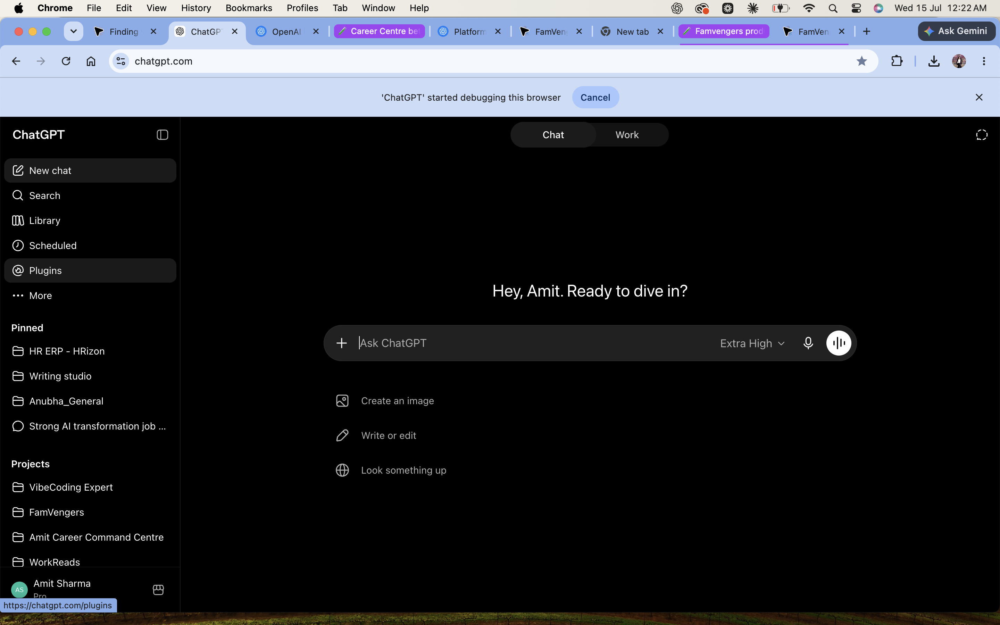
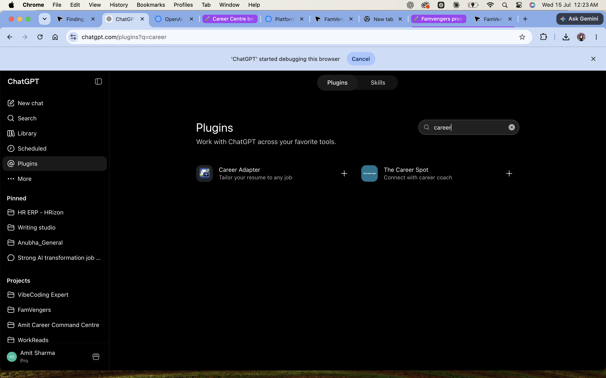
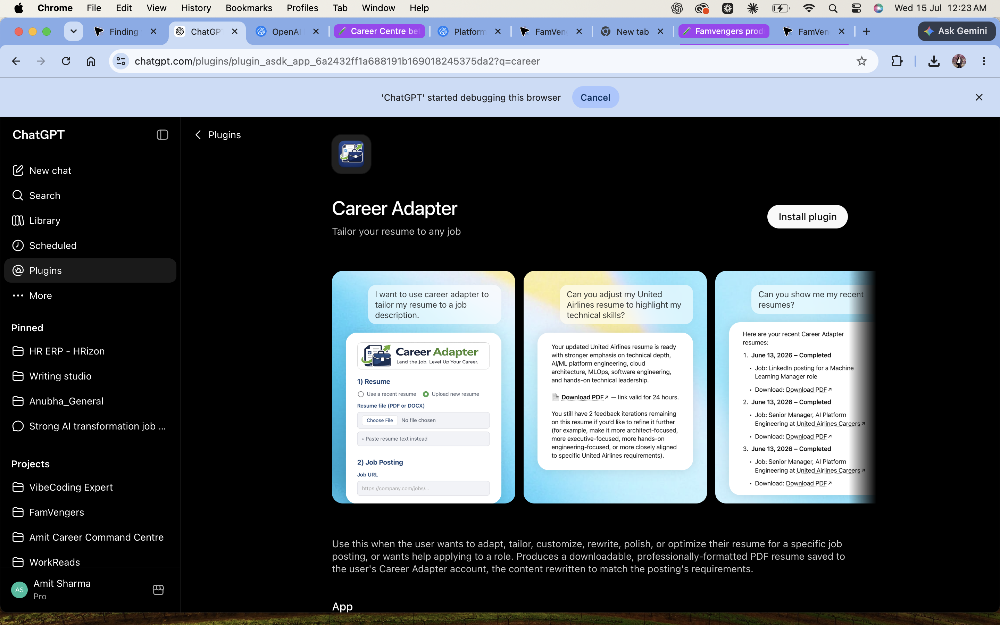
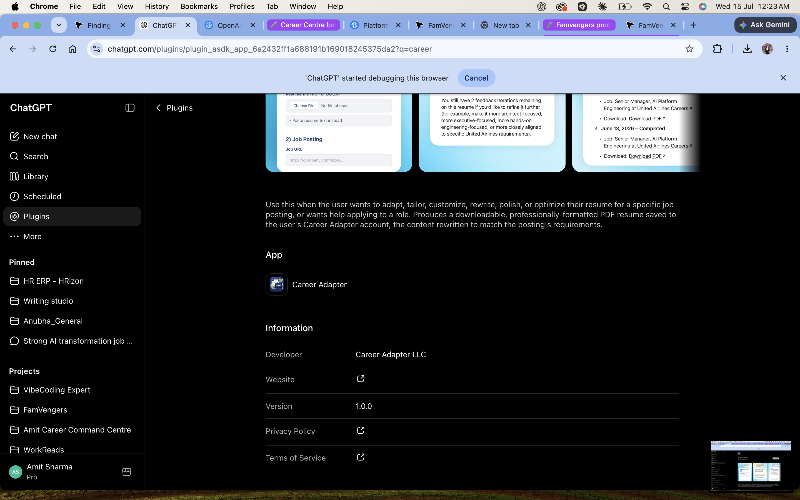

# Career Adapter listing audit

Date: 15 July 2026  
Scope: ChatGPT plugin discovery and the public Career Adapter listing, based on the four screenshots supplied in this audit run. This does not assess the installed product's output quality, privacy implementation, accessibility semantics or mobile behaviour.

## Overall verdict

Career Adapter's **listing presentation is good (about 8/10)**. Its strongest move is not a sophisticated interface: it is the three-panel story that makes the workflow understandable before installation. The underlying product may still be weaker or stronger than the listing suggests; that requires an installed-product test.

Career Centre has the broader and more defensible product proposition—role discovery, honest assessment, salary context, evidence safety, Word application packs and portable history—but its directory presentation should explain that value with the same visual immediacy.

## Step 1 — Enter the ChatGPT plugin area

Health: **Needs clarification**

- The Plugins entry is visible in the sidebar.
- The Chat/Work switch is easy to miss. Plugins are used in Work on the web, so onboarding should explicitly tell testers to switch to Work.
- The empty central state provides no cue about installed versus discoverable plugins.

## Step 2 — Search the directory

Health: **Healthy, but sparse**

- Search is fast and the install affordance is obvious.
- Career Centre is absent because the approved version has not yet been published; approval alone does not add it to the directory.
- The result cards depend heavily on name, subtitle and icon. Career Adapter's narrow promise is immediately understandable; Career Centre's broader promise needs equally concise positioning.

## Step 3 — Understand the competitor before installing

Health: **Strong**

- The three images tell a useful sequence: provide a CV and job posting, receive a tailored result, revisit recent outputs.
- Showing real interface states reduces uncertainty and makes the product feel tangible.
- The install button and subtitle remain visible beside the visual explanation.
- The screenshots contain very small text and the rightmost panel is partly clipped at this viewport. Their value comes from the sequence more than from readable details.

## Step 4 — Check trust and publisher information

Health: **Adequate**

- Developer, website, version, privacy and terms are surfaced in one predictable section.
- The description is long and technical for a marketplace page.
- Screenshot-only evidence cannot confirm keyboard navigation, focus visibility, meaningful image alternative text, screen-reader order or contrast compliance.

## What Career Centre should adopt

1. Use three purpose-built marketplace panels that show a coherent outcome story:
   - **Tell us what matters** — multiple CV upload plus the concise readiness receipt.
   - **Choose roles worth your time** — exact job links, salary context, fit, risks and a clear Apply/Maybe/Skip recommendation.
   - **Leave with something useful** — a polished two-page Word CV, cover letter and updated Career Passport/history.
2. Put one short user prompt and one large, legible output in each panel. Do not screenshot an entire dense conversation.
3. Explain continuity visually: “Keep one main conversation; export your Career Passport for a new chat.”
4. Keep the new compass-C icon and produce separate light- and dark-mode marketplace assets.

## What not to copy

- Do not lead with a form that makes the experience feel like another resume website.
- Do not imply publisher-hosted persistence. Career Centre's portable Career Passport is more transparent and keeps publisher cost at zero.
- Do not switch to PDF-only delivery, expiring links or a fixed feedback quota.
- Do not reduce the product to keyword rewriting. Career Centre's advantage is candid career judgment plus evidence-safe documents.
- Do not use tiny interface text as decoration; the core message must remain readable on a laptop and mobile listing.

## Highest-impact refinement

The next listing version should be `4.0.0-beta.3`: keep the approved product behaviour, replace the generic icon, add three legible marketplace panels and tighten the public description. Publish beta.2 first for a quiet friend beta if speed matters, then submit beta.3 as an update to the same plugin.

